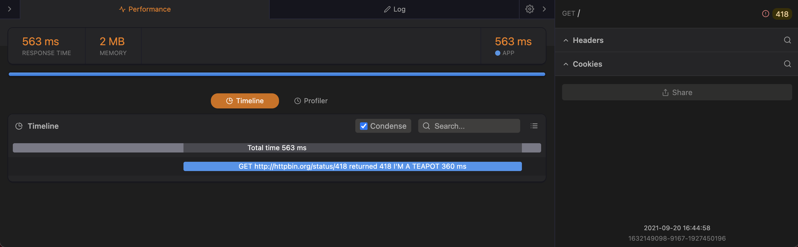
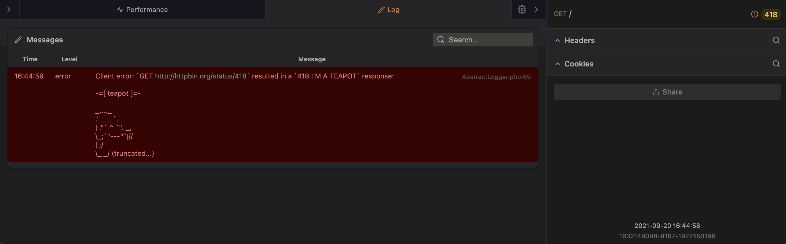

# [Guzzle](http://docs.guzzlephp.org/en/latest/) middleware for [Clockwork](https://github.com/itsgoingd/clockwork) logging

[](https://travis-ci.org/hannesvdvreken/guzzle-clockwork)
[](https://packagist.org/packages/hannesvdvreken/guzzle-clockwork)
[](https://scrutinizer-ci.com/g/hannesvdvreken/guzzle-clockwork/)
[](https://scrutinizer-ci.com/g/hannesvdvreken/guzzle-clockwork/)
[](https://packagist.org/packages/hannesvdvreken/guzzle-clockwork)
[](#license)

Guzzle middleware for logging requests clockwork's timeline so you can view the timeline in your browser's developer tools.





## Usage

```php
// First you need a Clockwork object
$clockwork = \Clockwork\Support\Vanilla\Clockwork::init();

// Create the Guzzle middleware
$middleware = new \GuzzleHttp\Profiling\Middleware(
    new \GuzzleHttp\Profiling\Clockwork\Profiler($clockwork->getClockwork()->timeline())
);

// Then you need to add it to the Guzzle HandlerStack
$stack = \GuzzleHttp\HandlerStack::create();

$stack->unshift($middleware);
$client = new \GuzzleHttp\Client(['handler' => $stack]);
```

Depending on your integration of Clockwork, make sure that you call `$clockwork->requestProcessed();` before you output your page.

### Laravel

If you are using Laravel, use the included service providers to add
the subscriber to every Guzzle Client.

```php
'providers' => [
    ...
    \Clockwork\Support\Laravel\ClockworkServiceProvider::class,
    \GuzzleHttp\Profiling\Clockwork\Support\Laravel\ServiceProvider::class,
],
```

Be sure to create every client (type hint with `GuzzleHttp\ClientInterface` or `GuzzleHttp\Client`) via the IoC container.

## Guzzle v4 and v5

Versions `0.2.0` and up until `1.0.0` (exclusively) are all compatible with Guzzle v4 and v5. To develop for these versions of Guzzle, use the `guzzle4-5` [branch](https://github.com/hannesvdvreken/guzzle-clockwork/tree/guzzle4-5).

Use

## Guzzle v3

If you want to continue to work with the old Guzzle v3 (`Guzzle\Http\Client` instead of `GuzzleHttp\Client`) ClockworkPlugin
then you might want to install the `0.1.*` releases. Pull request with Guzzle v3 compatibility should be made against the `guzzle3` [branch](https://github.com/hannesvdvreken/guzzle-clockwork/tree/guzzle3). Install the latest guzzle v3 compatible version with `0.1.*` or `dev-guzzle3`.

## Contributing

Feel free to make a pull request. Please try to be as
[PSR-2](https://github.com/php-fig/fig-standards/blob/master/accepted/PSR-2-coding-style-guide.md)
compliant as possible. Fix Code Style quickly by running `vendor/bin/php-cs-fixer fix`. Give a good description of what is supposed to be added/changed/removed/fixed.

### Testing

To test your code before pushing, run the unit test suite.

```bash
vendor/bin/phpunit
```

## License

[MIT](LICENSE)
